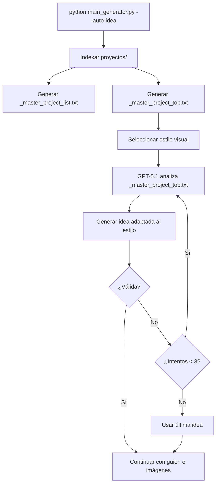

# Sistema de Generación de Ideas basado en Proyectos Virales

## 🎯 ¿Qué es esto?

El sistema de **generación automática de ideas** analiza tus proyectos anteriores más exitosos (virales y medio virales) para generar nuevas ideas que sigan los mismos patrones de éxito.

En lugar de generar ideas al azar, el modelo GPT-5.1 analiza:
- Tono y atmósfera de proyectos virales
- Tipos de misterio que funcionan
- Construcción de ganchos iniciales
- Patrones de protagonista y ambientación

Y genera ideas **originales** que tienen mayor probabilidad de ser virales.

---

## 📁 Estructura de Carpetas

```
dramatizaciones_auto/
├── proyectos/                    ← Aquí van tus proyectos anteriores
│   ├── 10_LAESPERA_v/            ← Proyecto viral (termina en _v)
│   │   └── texto.txt
│   ├── 25_METRO_mv/              ← Proyecto medio viral (termina en _mv)
│   │   └── texto123.txt
│   ├── 42_CASTILLO/              ← Proyecto normal
│   │   └── texto.txt
│   └── ...
├── _master_project_list.txt      ← Generado automáticamente
├── _master_project_top.txt       ← Generado automáticamente (solo virales)
├── main_generator.py
└── src/
```

---

## 🚀 Configuración Inicial

### Paso 1: Crear carpeta de proyectos

```bash
mkdir proyectos
```

### Paso 2: Copiar tus proyectos anteriores

Estructura de cada proyecto:
```
proyectos/
└── NUMERO_NOMBRE/
    └── texto*.txt
```

**Nomenclatura de carpetas:**
- `10_LAESPERA` - Proyecto normal
- `25_METRO_v` - Proyecto **viral** (termina en `_v`)
- `42_CASTILLO_mv` - Proyecto **medio viral** (termina en `_mv`)

El número al inicio es importante para ordenar cronológicamente.

**Ejemplo:**
```bash
cd proyectos/

# Copiar tus proyectos existentes
cp -r /ruta/a/10_LAESPERA_v ./
cp -r /ruta/a/25_METRO_mv ./
cp -r /ruta/a/42_CASTILLO ./

# Estructura resultante
ls -la
# 10_LAESPERA_v/
# 25_METRO_mv/
# 42_CASTILLO/
```

### Paso 3: Verificar archivos de texto

Cada proyecto debe tener un archivo `texto*.txt` con el guion.

El **indexador** lee la primera línea de contenido (sin etiquetas `[SPEAKER]` o `[imagen:X.png]`) como resumen del proyecto.

**Ejemplo de `texto.txt`:**
```
[NARRADOR]
Una mujer encuentra una habitación sellada en su nueva casa.
[imagen:1.png]
Al abrirla, descubre que cada objeto dentro predice eventos de su futuro...
```

La línea extraída sería: `"Una mujer encuentra una habitación sellada en su nueva casa."`

---

## 🔄 Uso del Sistema

### Opción 1: Modo Automático Completo

```bash
python main_generator.py --auto-idea --image-model gemini
```

**Qué hace:**
1. 📊 Indexa proyectos en `proyectos/`
2. ✍️ Genera `_master_project_list.txt` (todos los proyectos)
3. ✍️ Genera `_master_project_top.txt` (solo virales y medio virales)
4. 🎨 Te pide seleccionar un estilo visual
5. 🧠 Analiza patrones virales con GPT-5.1
6. 💡 Genera idea original adaptada al estilo
7. 📝 Crea guion, imágenes y proyecto completo

### Opción 2: Idea Manual

```bash
python main_generator.py --idea "Tu idea aquí" --image-model gemini
```

Salta el análisis de proyectos y usa la idea que proporcionas.

---

## 📝 Archivos Generados

### `_master_project_list.txt`

Índice completo de **todos** los proyectos.

**Formato:**
```
--- ÍNDICE DE PROYECTOS 'RELATOS EXTRAORDINARIOS' ---

Total de proyectos indexados: 42
--------------------------------------------------

10_LAESPERA_v: Una mujer encuentra una habitación sellada...
25_METRO_mv: Un vigilante nocturno descubre que...
42_CASTILLO: En un castillo abandonado...

==================================================
--- 🔥 TOTAL PROYECTOS VIRALES (_v): 15 ---
==================================================

10_LAESPERA_v
38_PALACIO_v
...

==================================================
--- 🌪️ TOTAL PROYECTOS MEDIO VIRALES (_mv): 8 ---
==================================================

25_METRO_mv
33_HOSPITAL_mv
...
```

### `_master_project_top.txt`

Índice **curado** solo con proyectos virales y medio virales.

**Este es el archivo que usa GPT-5.1** para generar ideas.

**Formato:**
```
--- ÍNDICE CURADO PARA IA: PROYECTOS VIRALES Y MEDIO VIRALES ---

==================================================
🔥 PROYECTOS VIRALES (_v): 15
==================================================

10_LAESPERA_v: Una mujer encuentra una habitación sellada...
38_PALACIO_v: Un periodista investiga desapariciones...

==================================================
🌪️ PROYECTOS MEDIO VIRALES (_mv): 8
==================================================

25_METRO_mv: Un vigilante nocturno descubre que...
33_HOSPITAL_mv: Una enfermera escucha susurros...
```

---

## 🛡️ Restricciones Automáticas

El sistema **valida automáticamente** las ideas generadas para evitar:

### ❌ Temas Prohibidos:
- Carreteras, autopistas, arcenes
- Coches, camiones, vehículos
- Conductores, camioneros
- Viajes en coche
- Taxis, autobuses

**Motivo:** Estos temas se repiten demasiado y tienen menor engagement.

### ❌ Inicios Prohibidos:
- "Medianoche"
- "A medianoche"
- "Eran las doce"
- "A las doce"

**Motivo:** Son comienzos clichés que reducen originalidad.

### ✅ Requisitos:
- **Protagonista único** claro
- **Lugar estático** o acotado (casa, hospital, bosque, ruinas, etc.)
- **Longitud:** 20-120 palabras
- **Originalidad:** No copiar literalmente de proyectos anteriores

---

## 🎨 Adaptación al Estilo Visual

El sistema adapta la idea al estilo visual que seleccionas.

**Ejemplo:**

Si seleccionas **"Fotorrealismo Cinematográfico (Thriller Moderno)"**, la idea se adaptará a:
- Contextos contemporáneos reconocibles
- Pisos actuales, hospitales, oficinas, bloques
- Terror basado en detalles cotidianos hiperrealistas
- Sensación de película de thriller moderno

Si seleccionas **"Acuarela Gótica (Bruma y Tinta)"**, la idea se adaptará a:
- Niebla, lluvia, bruma, oscuridad suave
- Bosques, acantilados, cementerios envueltos en niebla
- Siluetas, sombras difusas
- Figuras que apenas se distinguen entre manchas

---

## 🔍 Reintentos Automáticos

El sistema intenta hasta **3 veces** si la idea generada:
1. Contiene palabras prohibidas (coches, carreteras)
2. Empieza con "medianoche" o similares
3. Tiene longitud fuera del rango (20-120 palabras)

Si tras 3 intentos no lo consigue, usa la última idea generada de todas formas.

**Ejemplo de salida:**
```
⚠️ Intento 1/3: Idea con tema o inicio no deseado, o longitud rara. Reintentando...
   ↳ Motivo: referencia a coche/carretera/viaje.

⚠️ Intento 2/3: Idea con tema o inicio no deseado, o longitud rara. Reintentando...
   ↳ Motivo: inicio tipo 'medianoche' o similar.

======================================================================
💡 NUEVA IDEA GENERADA:
======================================================================
Un archivero encuentra un expediente sin fecha que describe eventos
que aún no han ocurrido. Cada página que lee se convierte en realidad
al día siguiente, pero las últimas páginas describen su propia muerte.
======================================================================
```

---

## ⚙️ Funciones del Código

### `src/utils/indexer.py`

**`index_projects(projects_dir, root_dir)`**
- Indexa todos los proyectos en `proyectos/`
- Genera `_master_project_list.txt` y `_master_project_top.txt`
- Clasifica virales (`_v`) y medio virales (`_mv`)

**`get_next_project_number(master_list_path)`**
- Lee `_master_project_list.txt`
- Determina el siguiente número de proyecto
- Útil para nombrar proyectos nuevos secuencialmente

### `src/content/ideation.py`

**`generate_automatic_idea(client, style_name, master_list_path)`**
- Lee `_master_project_top.txt`
- Genera prompt para GPT-5.1 con restricciones
- Adapta idea al estilo visual
- Valida y reintenta si es necesario
- Devuelve idea final

**`_generate_basic_idea(client, style_name)`**
- Genera idea básica si no hay proyectos anteriores
- Fallback si no existe `_master_project_top.txt`

---

## 🆘 Solución de Problemas

### ⚠️ "No se encontró _master_project_top.txt"

**Causa:** No existe la carpeta `proyectos/` o está vacía.

**Solución:**
```bash
mkdir proyectos
# Copiar proyectos anteriores a proyectos/
```

El sistema generará una idea básica sin análisis de virales.

### ⚠️ "No se encontró 'texto*.txt' en 'PROYECTO_X'"

**Causa:** La carpeta del proyecto no tiene archivo de texto.

**Solución:**
```bash
# Verificar que cada proyecto tenga texto.txt
ls proyectos/*/texto*.txt

# Si falta, copiar o crear
echo "Contenido del proyecto" > proyectos/PROYECTO_X/texto.txt
```

### ⚠️ Ideas siempre contienen temas prohibidos

**Causa:** Los proyectos virales en `proyectos/` contienen muchos temas de carreteras.

**Solución:**
1. Revisa `_master_project_top.txt`
2. Elimina o renombra proyectos con temas de carreteras
3. Vuelve a ejecutar con `--auto-idea`

---

## 📊 Estadísticas del Indexador

Al ejecutar, verás:

```
📁 Buscando proyectos en: /ruta/a/proyectos
  -> Indexado: 10_LAESPERA_v (usando 'texto.txt')
  -> Indexado: 25_METRO_mv (usando 'texto123.txt')
  -> Indexado: 42_CASTILLO (usando 'texto.txt')
  -> AVISO: No se encontró 'texto*.txt' en '55_PRUEBA'

==================================================
✅ Índice completo creado en: _master_project_list.txt
✅ Índice curado para IA creado en: _master_project_top.txt
📊 Indexados 42 proyectos
🔥 Virales: 15 | 🌪️ Medio virales: 8
==================================================
```

---

## 🎓 Mejores Prácticas

1. **Marca tus virales** con `_v` al final del nombre de carpeta
2. **Marca tus medio virales** con `_mv`
3. **Numera secuencialmente** los proyectos (10, 11, 12...)
4. **Primera línea impactante** en `texto.txt` (es lo que se indexa)
5. **Actualiza regularmente** copiando nuevos proyectos a `proyectos/`
6. **Revisa `_master_project_top.txt`** para ver qué analiza la IA

---

## 🔗 Flujo Completo



---

## 📦 Incluir en Paquetes

Si distribuyes el proyecto, **NO incluyas `proyectos/`** en los paquetes.

Cada usuario debe:
1. Crear su propia carpeta `proyectos/`
2. Copiar sus propios proyectos anteriores
3. El sistema se adapta automáticamente

---

## ✨ Resumen

- ✅ Crea `proyectos/` con tus proyectos anteriores
- ✅ Nombra virales con `_v` y medio virales con `_mv`
- ✅ Cada proyecto debe tener `texto*.txt`
- ✅ Usa `--auto-idea` para generación inteligente
- ✅ El sistema evita temas repetidos automáticamente
- ✅ La idea se adapta al estilo visual seleccionado

**¡Genera ideas virales basadas en datos reales de éxito!** 🚀
